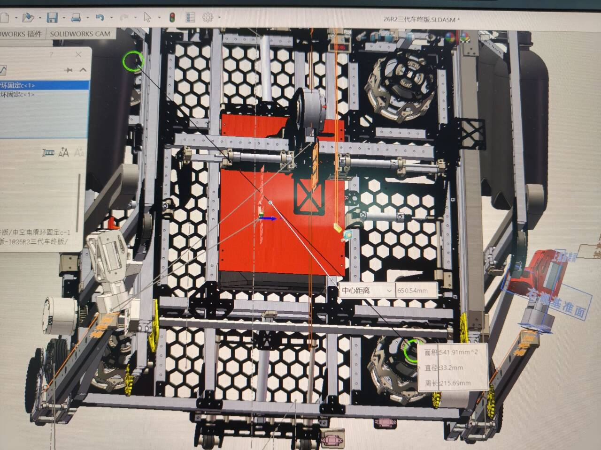
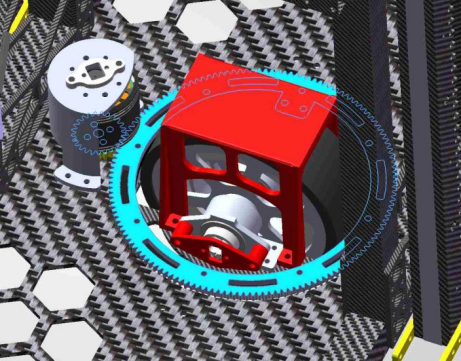
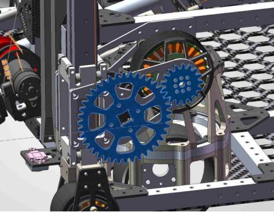
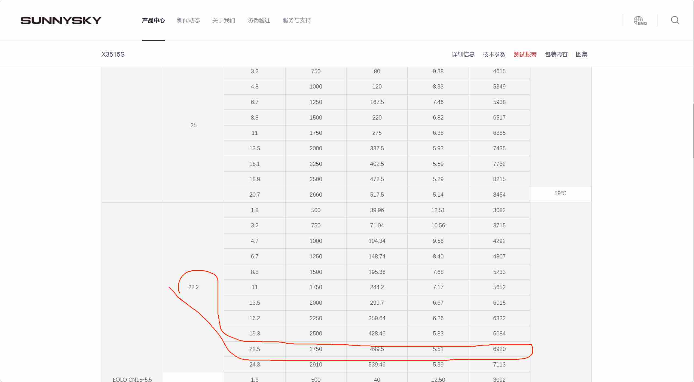

## 8.3作业提交

### 1.车中心距轮中心水平距离为：325.27mm

### 2. 减速比
- R1舵轮回转减速比：28/5
  

- R2上台阶机构的减速比40/17
 

### 3.朗宇X3515S在22.2V电压、22.5A电流下的扭矩 T=9550×0.4995/6920​≈0.69 N⋅m

### 4.电机、舵机和气缸的适用情况及优缺点

#### 1. 电机

电机适合需要连续旋转、速度调节或精确位置控制的机构，
例如底盘车轮、舵轮回转、机械臂、摩擦轮、输送机构和
丝杠升降机构。

优点：
- 可以连续旋转；
- 转速、位置和力矩可通过程序进行调节；
- 可与齿轮、同步带、链条和丝杠等多种传动结构配合；
- 配合编码器后可以实现较高精度的闭环控制。

缺点：
- 需要驱动器、编码器及控制程序，系统相对复杂；
- 高速电机通常需要额外减速；
- 堵转或过载时容易产生大电流和发热；
- 控制参数和机械传动需要调试。

#### 2. 舵机

舵机适合小型、轻载且需要指定角度定位的机构，例如
小挡板、导向片、小型机械爪和传感器转向机构。

优点：
- 集成电机、减速器和位置控制，使用方便；
- 可以直接控制目标角度；
- 体积较小，结构布置简单；
- 适合快速完成小型机构原型。

缺点：
- 普通舵机输出扭矩和转角范围有限；
- 内部齿轮存在间隙，反向运动精度可能下降；
- 抗冲击能力较弱；
- 堵转或长时间保持较大负载时容易发热或损坏。

#### 3. 气缸

气缸适合只需要两个主要工作状态、要求快速动作和较大
直线推力的机构，例如夹紧、推出、锁止、插销和挡板开合。

优点：
- 能够在较小体积下提供较大推力；
- 直线运动直接，不需要额外的旋转—直线转换机构；
- 控制逻辑较简单；
- 动作速度快，适合快速触发机构。

缺点：
- 普通气缸不适合精确的多位置控制；
- 需要气瓶、气管、电磁阀和限流阀等完整气路；
- 气压变化会影响输出力和运动速度；
- 动作到达行程终点时可能产生冲击和振动；
- 气缸杆不能长期承受侧向力，也不能代替导轨使用。